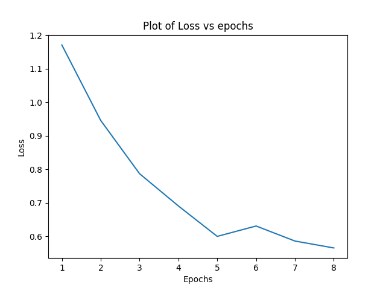
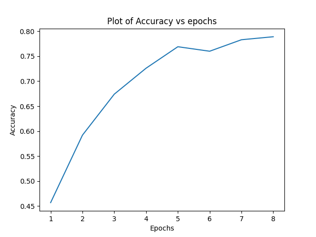

# Character-Level Convolutional Networks for Text Classification

## Brief Description

This work looks into the use of convolutional
networks on character level instead of
traditional methods for text classification. Large
datasets are used to show that results are as
competitive as other methods. Comparison is
done with models such as bag of words,
n-grams, and deep learning models such as
word-based ConvNets and RNNs.

## Setup and Installation

- Requirements have been mentioned in `requirements.txt` 
- python environment of version 3.8 or higher is necessary for some inbuilt commands so the testing environment should be appropriate

<!-- ## Sample outputs -->

<!-- - The sample outputs are shown below : -->

<!--  -->

<!--  -->

## Running the collaboratory notebook

- The notebook can be run on google collaboratory by uploading the notebook and the dataset to the collaboratory environment, after ensuring all the dependencies given in the `requirements.txt`  are met.

### Team no - 7

### Team Name : Anoop Sir Op

#### Team Members : 
- Mitul Garg (2020102026)
- Jay Ghevariya (2020101070)
- Atharv Sujlegaonkar (2020102025)
- Tirth Motka (2020101036)

## Biblography:
- Character-Level Convolutional Networks for Text Classification, [link](https://github.com/Patel-Technologies/Text-Classification-CNN/blob/main/Research_Paper.pdf) 
